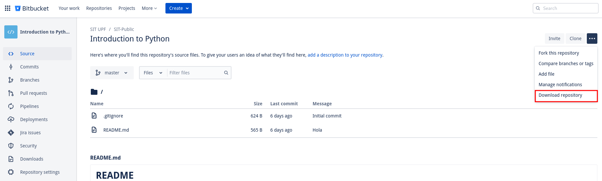
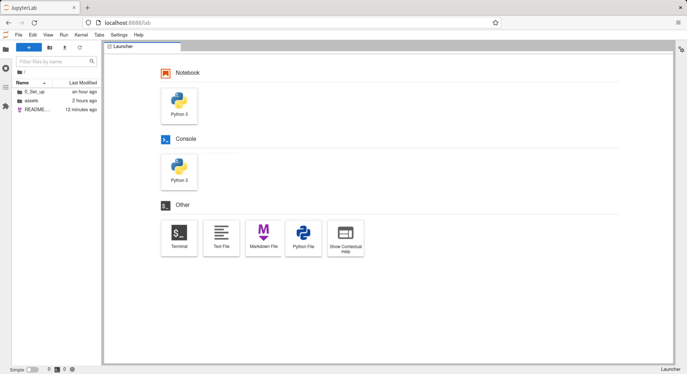
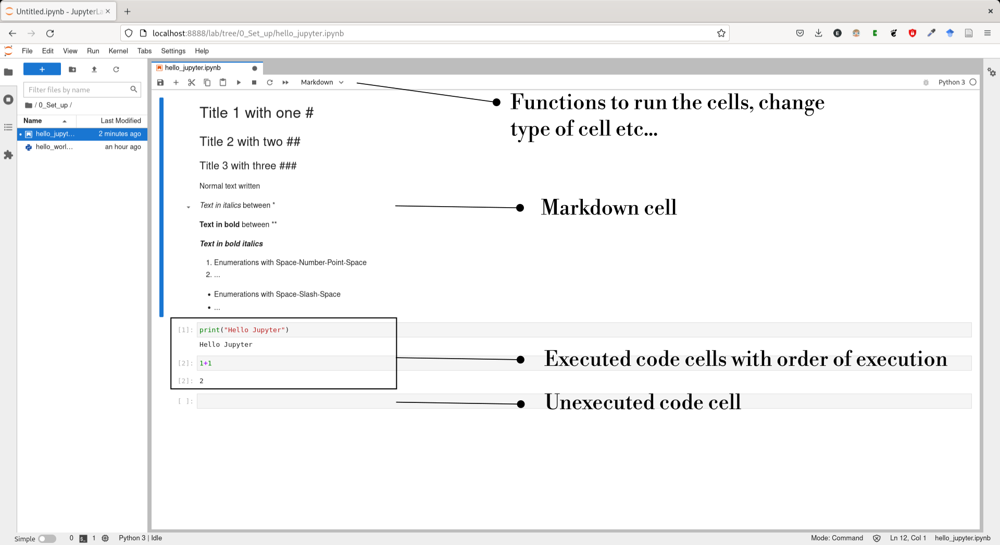
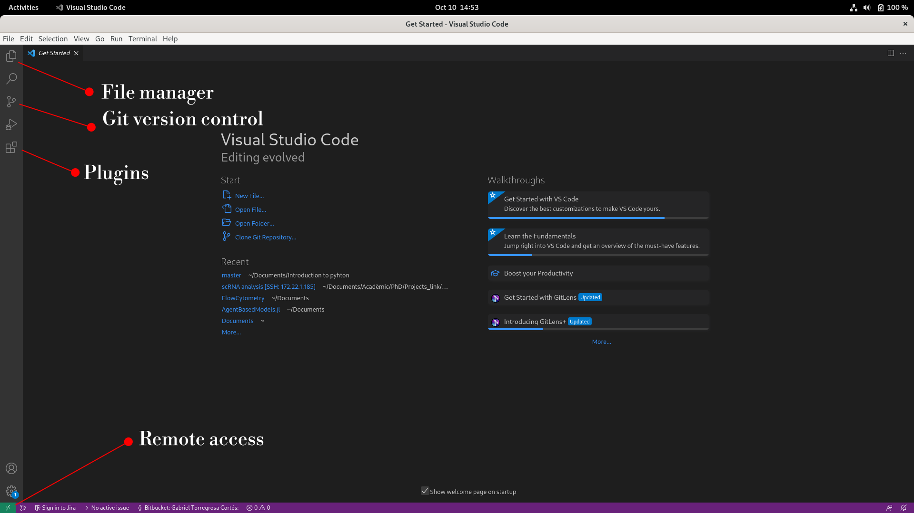
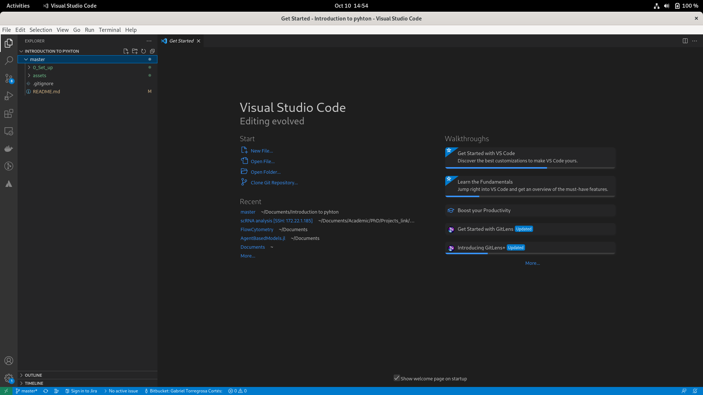
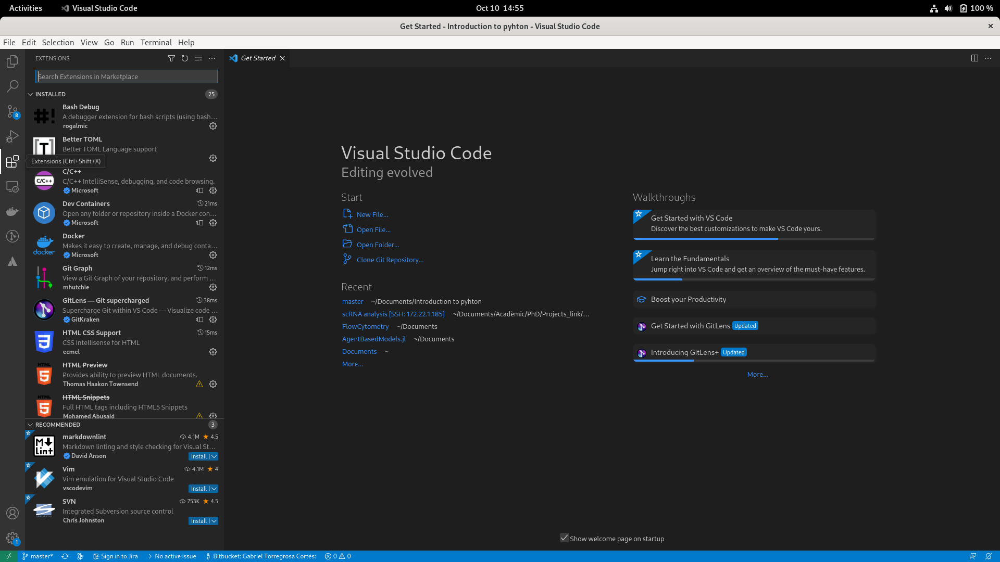
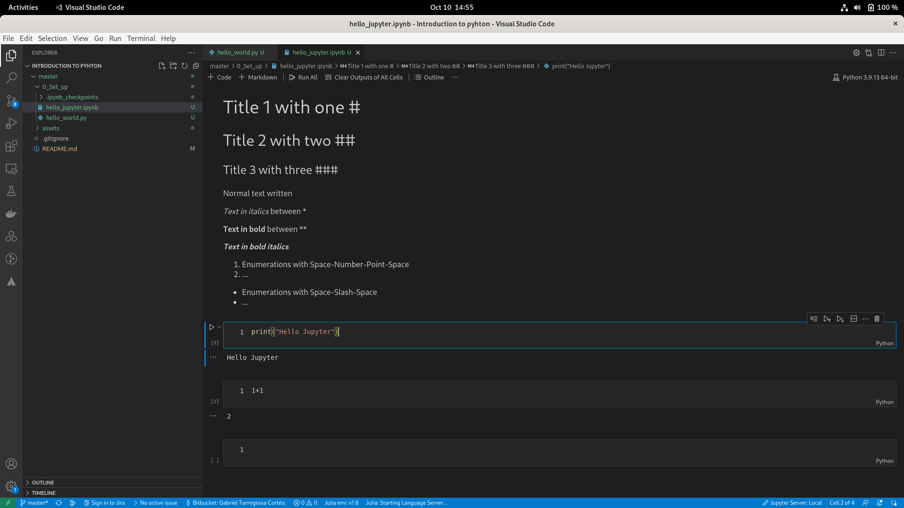

Most parts of the information in these notes are relevant for you to start working and to understand the basics of programming. Additional information for more advanced users and interested people will be provided in note boxes and can be skipped for basic understanding. These boxes look like this:

> **NOTE This is additional information that can be skipped** 
## Table of contents

 1. [What is python](#what-is-python)
 2. [Downloading this repository](#downloading-this-repository)
 3. [Installing Python](#installing-python)
    1. [Working with the interactive shell](#working-with-the-interactive-shell)
    2. [Working with python files](#working-with-python-files)
 4. [Installing Python Packages](#installing-python-packages)
 5. [Installing Jupyter](#installing-jupyter)
 6. [Installing Visual Studio Code (Optional but advisable)](#VSCode)
 7. [Summary](#summary)

<a id='what-is-python'></a>
# What is Python?

Python is a general-purpose high-level interpreted language created at the end of the 80s. Let's split all these fancy adjectives:

 - **General purpose** means that its intention of use is all sorts of tasks. With Python, you can control how to manage data on your computer, edit a video, create a web app or do science. This feature stands against other programming languages that are more task-specific and were designed for a single purpose for example Matlab. 
 - **High-level** means that the language is close to human readable.
 - **Interpreted** means that the language is converted to instructions that the computer will read at the moment that it is run. This is different from other languages that are *compiled* as C, in which the code is converted to computer-interpretable code before running it. This has an important implication as python code can be created on the fly and used in a more "interactive" mode, which is great for data analysis purposes in which we may need to change things and play with the data around before we have a definitive thing.

 These properties above mentioned made Python one of the most used languages of programming nowadays with hundreds of thousands of programmers around the world with hundreds of mature packages, good documentation, and a big community that can help you out when you get stuck.

<a id='downloading-this-repository'></a>
# Downloading this repository

**Option 1:** You can download this repository on your computer manually:



**Option 2:** Or using git put this line of commands in your terminal (if you do not know how to open a terminal in Windows [this may help](https://www.wikihow.com/Open-Terminal-in-Windows)):

```
$ git clone git@bitbucket.org:situpf/introduction-to-python.git
```

> **NOTE: What is git?** Git is a command line tool for version control for coding projects both locally and in remote sites (as bitbucket, where this project is stored.). It is installed in Linux by default, but not necessarily in Mac or Windows. Although it is not necessary for this project, it is a tool that will become very useful if you start programming seriously. You can install it [here](https://git-scm.com/).

<a id='installing-python'></a>
# Installing Python

Since python is such an extended programing language, there are many different ways in which programmers work with Python. Before proceeding to any installation it would be good that make clear some key concepts on programming setups. Any programmer needs two main things while programming:

 1. **A programing language**. This is the programming language and the software required that makes that when you write some code, it interprets it and executes it in the computer. This is our case will be Python.
 2. **An coding environment**. These will be programs that allow us to write code comfortably. In practice this can be any text editor, a simple text writer can work. However, some more sophisticated editors will help us a lot to write code and work with complex pipelines. We will discuss this part in the following section.


**Option 1**: Python can be installed from its [official release](https://www.python.org/downloads/). 

> **NOTE Alternative installations Option 2** Python can be installed within more complex distributions. Some may have heard of Anaconda or Conda. Anaconda is a distribution for package management for many programming languages. Its default installation installs Python, several packages that are commonly used in machine learning and science, a simple code editor called Spyder, and some additional features for package management. It can be installed from its [official webpage](https://docs.anaconda.com/anaconda/install/). If you want to have a deeper understanding of the differences between Python and Conda, you can read [this post](https://www.dataquest.io/blog/python-vs-anaconda/).

<a id='working-with-the-interactive-shell'></a>
## Working with the interactive shell

Once installed, we should be able to run it. One of the most basic ways of working with Python is to execute an interactive shell. For that open a terminal and call python in the following way:

```
$ python
```

If python is correctly installed, something like the following will appear:

```
$ python
Python 3.9.13 (main, May 18 2022, 00:00:00) 
[GCC 11.3.1 20220421 (Red Hat 11.3.1-2)] on Linux
Type "help", "copyright", "credits" or "license" for more information.
>>> 
```

Now you are in the interactive shell of Python! As we mentioned above, Python is an **interpreted** language, which means that it interprets code as it reads it and transforms it to machine language on compilation time. This property is the one that allows we can write things and execute them "on the fly". Check for example to make a sum:

```
>>> 1+1
2
```

or print _hello_ in the screen:

```
>>> print("Hello")
Hello
```

Finally, we can exit the shell to return to the directory:

```
>>> exit()
$ 
```

<a id='working-with-python-files'></a>
## Working with python files

Alternatively to the interactive mode, we can execute code already written in a file. Inside the repository look for a file called `0_Set_up/hello_world.py`. The termination `.py` indicates that what is inside the file is python code and the python interpreter will be able to execute it. You can open the file in any text editor and you will see that inside there is written the following code:

```
print("Hello Python!")
```

This is the code we wrote in the interactive mode, but now we have it in a file and we can reuse it anytime we need it. To run the code, open a terminal in the folder `0_Set_up` (if you do not know how to open a terminal in a folder, [this may help](https://www.groovypost.com/howto/open-command-window-terminal-window-specific-folder-windows-mac-linux/)). Then, you can execute the code by running:

```
0_Set_up$ python hello_world.py
Hello Python!

0_Set_up$
```

Python will execute whatever is in the file and then return to the terminal. You can execute this file from anywhere as long as you give the right address to the file. Check that opening the terminal from the folder `master` and executing:

```
master$ python 0_Set_up/hello_world.py
Hello Python!

master$
```

Now you know how to start working with python!çç

<a id='installing-python-packages'></a>
# Installing Python Packages

We have all the Python functionality. We could start from here and start coding everything we need but, as we mentioned above, python has a big community and a lot of mature packages around where most parts of the things that we will use have been already implemented. To install this package we will use `pip`, the package manager of python. We will enter into details when we describe how to use packages. For now and to get everything ready for the tutorial, the only thing that we will need is to install a few packages. In a terminal write the following:

```
$ pip install numpy scipy matplotlib seaborn pandas scikit-learn scikit-image
```

This will install a set of packages that we will use in the following days. For now, check that you correctly installed the packages by executing in a terminal in `0_Set_up`:

```
$ python check_packages.py
```

If everything is correct, you would not have to see any messages returned. If there has been some problem during the installation, messages on how to solve the problem will appear.

<a id='installing-jupyter'></a>
# Installing Jupyter

When working with the interactive shell, we were able to execute code "on the fly" and see the results but we couldn't save the results of the executed code after exiting the shell. When executing code, we are running the code written in a file, so we can reuse it but we are running all the code of each file, which is not optimal if we want to check the results of small parts of a long pipeline. Could we have a bit of both world?

Jupyter is a software that allows you to generate interactive python (and other languages) files that you can run and play around with and keep after finishing the analysis. 

You can install it from [here](https://jupyter.org/). You can install it in several flavors. I advise that you install Jupyter lab.

Once installed, you can test that is working by running a jupyter notebook by executing it in a terminal in our `master` file.

```
$ jupyter lab
[I 2022-10-10 11:12:05.891 ServerApp] jupyterlab | extension was successfully linked.
[I 2022-10-10 11:12:05.905 LabApp] JupyterLab extension loaded from /home/myuser/.local/lib/python3.9/site-packages/jupyterlab
[I 2022-10-10 11:12:05.905 LabApp] JupyterLab application directory is /home/myuser/.local/share/jupyter/lab
[I 2022-10-10 11:12:05.907 ServerApp] jupyterlab | extension was successfully loaded.
[I 2022-10-10 11:12:05.908 ServerApp] Serving notebooks from local directory: /home/myuser
[I 2022-10-10 11:12:05.908 ServerApp] Jupyter Server 1.12.1 is running at:
[I 2022-10-10 11:12:05.908 ServerApp] http://localhost:8888/lab?token=323100cc839183ec0189d0e3e79127f3e661240b7a240040
[I 2022-10-10 11:12:05.908 ServerApp]  or http://127.0.0.1:8888/lab?token=323100cc839183ec0189d0e3e79127f3e661240b7a240040
[I 2022-10-10 11:12:05.908 ServerApp] Use Control-C to stop this server and shut down all kernels (twice to skip confirmation).
[C 2022-10-10 11:12:05.935 ServerApp] 
    
    To access the server, open this file in a browser:
        file:///home/myuser/.local/share/jupyter/runtime/jpserver-28571-open.html
    Or copy and paste one of these URLs:
        http://localhost:8888/lab?token=323100cc839183ec0189d0e3e79127f3e661240b7a240040
     or http://127.0.0.1:8888/lab?token=323100cc839183ec0189d0e3e79127f3e661240b7a240040
[W 2022-10-10 11:12:09.043 LabApp] Could not determine jupyterlab build status without nodejs
[W 2022-10-10 11:12:09.194 ServerApp] 404 GET /api/contents/Usage.ipynb?content=0&1665393129187 (127.0.0.1): No such file or directory: Usage.ipynb
[W 2022-10-10 11:12:09.195 ServerApp] No such file or directory: Usage.ipynb
[W 2022-10-10 11:12:09.195 ServerApp] 404 GET /api/contents/Usage.ipynb?content=0&1665393129187 (127.0.0.1) 1.34ms referer=http://localhost:8888/lab
```

Alternatively, if you installed jupyter notebook, you should write

```
$ jupyter notebook
```

When executing a file will open in a browser a page like this:



Where you will be able to create your notebooks. For now, open the file `0_Set_up/hello_jupyter.ipynb`. The `.ipynb` indicates that this is a jupyter notebook. This notebook contains cells. These cells can be code (in our case Python code) and markdown cells with markdown syntax that serves the purpose of writing and commenting on your code or analysis. If you open the file, you will see something like this:



If everything has been installed correctly, Jupyter would have found a python in your computer and will immediately assign it to your notebook so when you execute a code cell in the notebook, it will basically run it inside the python shell and return the output here. You should be able to run the code by pressing the `run` button from functions or the `run all` or pressing `Shift+Enter`.

For this tutorial, we will be using Jupyter notebooks a lot as they make the learning and test procedure a lot easier. In the file, you can change the code of the cells by double-clicking on the cells and modifying the text in the markdown cell, changing the format of the cell, or changing the sum numbers and rerunning the cell to see how the output has changed.

> **NOTE Advance markdown syntax** The markdown syntax in the file is just a short example of the writing syntax. You can also write equations, and even put images in the file cells. More complete guides can be found [here](https://www.markdownguide.org/basic-syntax) or (here)[https://www.fabriziomusacchio.com/blog/2021-08-10-How_to_use_LaTeX_in_Markdown/].

<a id='VSCode'></a>
# Installing Visual Studio Code (Optional but advised)

So far we have seen ways for working with Python code. Are there any more steps or additional software that can help us somehow? Well, as for Python, we have everything that we need. However, the above thing is only to work with python. So things are missing:

 - Working with other languages in the same project (R, C, HTML, ...)
 - Working remotely
 - Control the development of your code (version control, we mentioned already when talking a bit about git)
 - Connection with hosting servers (as Bitbucket, where you founded this)
 ...

There are many different editors that group all these utilities inside one single tool. One of the most used worldwide because of its great features is Visual Studio Code. If you are familiar with others and you like them, please stay with them.

One of the most famous and that most coders around the world use as it is free and has an incredibly good functionality of Visual Studio Code. You can download it from the [official source](https://code.visualstudio.com/).

When you open it for the first time VSCode, it will look something like this:



There are a million things that you can do with VSCode and it is not the scope of this tutorial to master it, you will slowly discover all the potential functions as you use and progress with your coding skills. For the scope of this tutorial the only things that we will use are:

 1. Opening the folder where you have the repository. You can do that in `Files`



 2. Add plug-ins. The plug-ins special things that you add to the basic VSCode environment. These are several that will be extremely useful for this tutorial and some others that you may need someday. You can install the ones you consider that will suit you:
    - **Python** You should add this to have highlighting of python code. It acts like a dictionary in a text editor, highlighting misspellings and other relevant words. It will help you visualize where there are mistakes in the code.
    - **Jupyter** This will highlight code in Jupyter as well as allow to execute Jupyter notebooks inside VSCode directly!
    - **Git graph (Optional)** This is for visualizing git controls.
    - **SSH Remote (Optional)** This will give functionality to connect remotely, for example, to your work computer remotely from another computer or to the cluster of the university!



 3. Finally, check that once you added the plugins, you can open the `0_Set_up` folder scripts. You should see the code with different colors as it is highlighted by the new plug-ins, as well as execute the jupyter files as before but now inside VSCode without using the terminal at all.



<a id='summary'></a>
# Summary

By the end of this document you should have installed:

 - Python (optionally Anaconda)
 - Several Python packages
 - Jupyter
 - (Optionally) Visual Studio Code

And learned how to:
 - Execute the interactive shell of python
 - Execute python files
 - Open Jupyter lab (or jupyter notebook)
 - Execute Jupyter files and some markdown syntax.
 - (Optionally) Become familiar with VSCode basic environment.

With all these tools in your hands, we are ready to start the tutorial.

