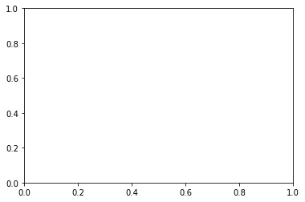
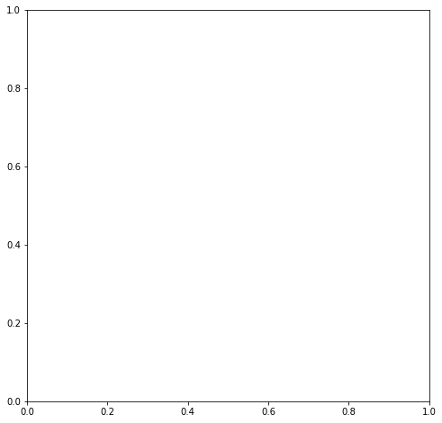
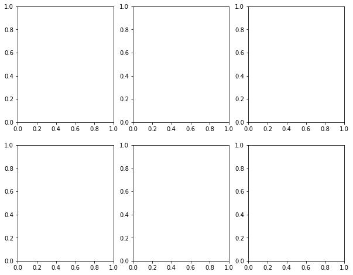
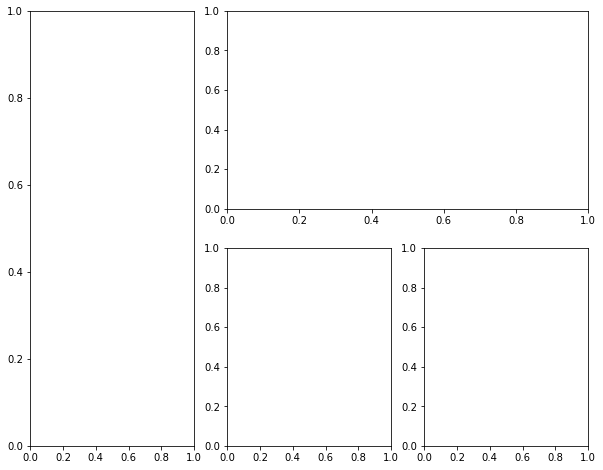
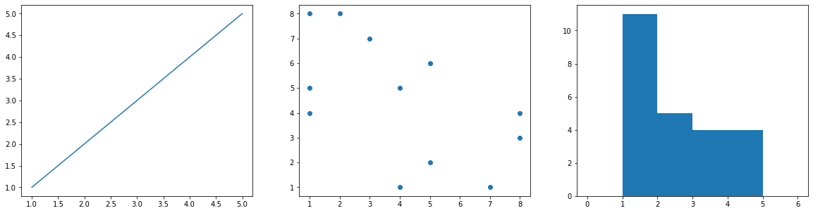
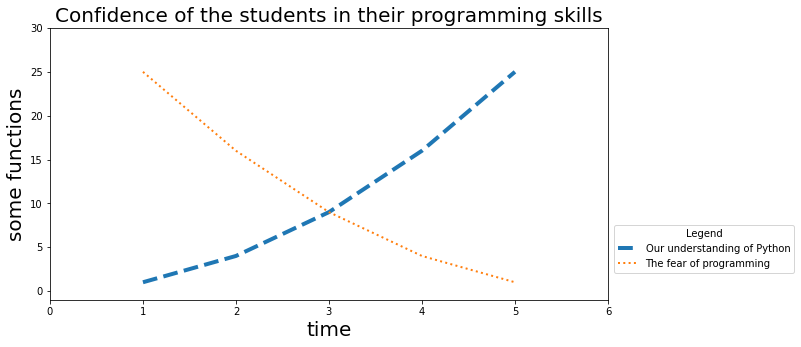

# Matplotlib

Matplotlib stands for mathematical plotting library and is the package for making scientific plots by excellence of python. There is much functionality in the library. You can make simple graphs to videos and it is highly customizable. Our intention is here to understand the basics of how to make plots for visualizing your science.

> **NOTE** Ther are many ways in which you can get things done with matplotlib. In here we aim to explain one of the many different ways to get it done for starters. As your need get more complex, you keep advancing in your programing skills, you will figure out other ways of doing your plots.

For our tutorial here, and for the most part of your plotting needs, we will only require a module (a subpackage) from the matplotlib package called `pyplot`. Let's import it.


```python
import matplotlib.pyplot as plt
```

## Constructing figures and Axes

There are two basic objects to have in mind:

 - **Figure**: Is the object that contains all the images of your file. Plainly speaking, it is the rectangle where all the images will be created.
 - **Axes**: Is a plot that of the potentially many of the figures.

To make it more clear, see [this image](https://www.nature.com/articles/s41420-022-01237-5/figures/4). The `Figure` object will be the whole image, the `Axes` objects will be each of the panels (A, B, C, D and E).

A very basic way of generating a figure with single axes will be to call the function `subplots`.


```python
fig, ax = plt.subplots()
```


    

    


We can define the size of the figure too.


```python
fig, ax = plt.subplots(figsize=[8,8])
```


    

    


If we want to make a figure with several axes in grid form:


```python
fig,ax = plt.subplots(2,3,figsize=[10,8])
```


    

    


```python
fig.savefig("../../output.png")
```

Finally, we can make more complex figures using the function `subplot_mosaic` where we specify a grid and the regions of the grid that should be occupied by each Axes.


```python
fig, ax = plt.subplot_mosaic([["A","B","B"],["A","D","E"]],figsize=[10,8])
```


    

    


## Making plots in the axes

The axes now can be filled with different plots. There are many different plots available by default in matplotlib. 

We can see some of the basics. However, more advanced plot options will be seen in the following package `seaborn`.

Let's try some basic plots:
 - plot
 - scatter
 - histogram

Many examples and other plots can be in the [official documentation](https://matplotlib.org/stable/gallery/index.html).

Let's make the plots using the `subplots` and `subplot_mosaic` function. Pay attention that when using `subplots` for more than a plot, the variable `ax` is now an array of axes that access by the coordinate of the grid; and when using the `subplot_mosaic`, a dictionary is returned and is accessed by the string associated with the image.


```python
fig, ax = plt.subplot_mosaic([["A","B","C"]],figsize=[20,5])

ax["A"].plot([1,2,3,4,5],[1,2,3,4,5])
ax["B"].scatter([1,4,5,2,8,3,7,1,8,4,1,5],[4,5,2,8,3,7,1,8,4,1,5,6])
ax["C"].hist([1,1,1,1,1,1,1,1,1,1,1,2,2,2,2,2,3,3,3,3,4,4,4,4],bins=[0,1,2,3,4,5,6]); #bins specify the ends of the bins
```


    

    


## Adding information to the axes

The last piece of information to make an informative plot is to add information such as title, axis labels, legends, etc...

Let's see some small examples of how to add basic information to our plots.


```python
fig, ax = plt.subplots(1,1,figsize=[10,5])

ax.plot([1,2,3,4,5],[1,4,9,16,25],linewidth=4,linestyle="dashed",label="Our understanding of Python")
ax.plot([1,2,3,4,5],[25,16,9,4,1],linewidth=2,linestyle="dotted",label="The fear of programming")

ax.set_title("Confidence of the students in their programming skills",fontsize=20)
ax.set_xlabel("time",fontsize=20)
ax.set_ylabel("some functions",fontsize=20)
ax.legend(title="Legend",loc=(1.01,.1))
ax.axis([0,6,-1,30]) #Set the limits of observation of the axis
```


    (0.0, 6.0, -1.0, 30.0)


    

    


## Saving

Once we are happy with the image, we can save using the method from the figure object `savefig`.


```python
fig.savefig("Myfigure.pdf")
```

# Seaborn

Matplotlib has many implementations predefined and is very basic. This means that sometimes we have to write a lot of commands to tune the plot to have the desired outcome.

Seaborn is a package that constructs over matplotlib.pyplot and incorporates many predefined plot pipelines that provide a more presentable without the need for so much coding. In addition, the package is implemented to exploit all its features in combination with `pandas`, a package that we will discuss soon. 

If we repeat the same examples as above but use seaborn to make the plots, we will see that it is almost the same as writing with the default matplotlib. Although visually for these simple examples the differences are very simple, we will see the difference in more complex examples in the future. For now, you can see the [gallery of examples](https://seaborn.pydata.org/examples/index.html) to have an idea of predefined plotting pipelines.


```python
import seaborn as sns
```


```python
fig, ax = plt.subplots(1,1,figsize=[10,5])

#Only this lines are changing
sns.lineplot(x=[1,2,3,4,5],y=[1,4,9,16,25],linewidth=4,linestyle="dashed",label="Our understanding of Python", ax = ax)
sns.lineplot(x=[1,2,3,4,5],y=[25,16,9,4,1],linewidth=2,linestyle="dotted",label="The fear of programming", ax = ax)

ax.set_title("Confidence of the students in their programming skills",fontsize=20)
ax.set_xlabel("time",fontsize=20)
ax.set_ylabel("some functions",fontsize=20)
ax.legend(title="Legend",loc=(1.01,.1))
ax.axis([0,6,-1,30]) #Set the limits of observation of the axis
```


    (0.0, 6.0, -1.0, 30.0)


    

    


```python
fig, ax = plt.subplots(1,3,figsize=[20,5])

sns.lineplot(x=[1,2,3,4,5],y=[1,4,9,16,25],ax=ax[0])
sns.scatterplot(x=[1,4,5,2,8,3,7,1,8,4,1,5],y=[4,5,2,8,3,7,1,8,4,1,5,6],ax=ax[1])
sns.histplot([1,1,1,1,1,1,1,1,1,1,1,2,2,2,2,2,3,3,3,3,4,4,4,4],bins=[0,1,2,3,4,5,6],ax=ax[2]); #bins specify the ends of the bins
```


    

    


# Summary

By the end of this tutorial we should have learned:

 - What are `Figure` and a `Axes` objects.
 - How to construct a figure and axes in different dispositions.
 - How to make plots in the axes.
 - How to add information and tune our plots and axes.
 - How to make plots with `seaborn`.


