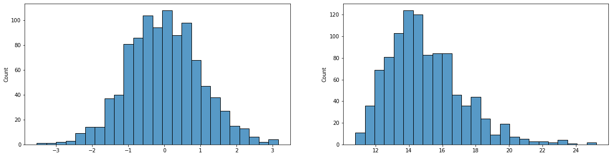

# Numpy

The library numpy stands for Numerical Python and is the standard for working with data arrays. We already saw an example of use in the previous section when importing packages.

Among the functionalities of the package, we have:

 1. Basic mathematical functions (cos, sin, tan, exp...)
 2. Matrix construction (zeros, eye, ones)
 3. Operate with matrices (sum, cumsum, mean...)
 4. Random number generation (rand, seed)

The full documentation can be found [here](https://numpy.org/).

Let's import the package. 

> **NOTE: Abreviations** As we saw in the previous tutorial, we can abreviate the name of the packages as we want when importing. However, some packages that are very commonly used have abreviations that everybody uses and are kind of an standard. In the case of `numpy`, the abreviation is `np`. Usually, you can find the abreviation in the own tutorials of the package (see for example [this one](https://numpy.org/devdocs/user/quickstart.html)).


```python
import numpy as np
```

## What are data arrays?

Data arrays are containers like lists or dictionaries. The main characteristics are:

 1. All the elements are of the same DataType (Int, Float...)
 2. They are organized in N dimensions (1 is a Vector, 2 is a Matrix...)

It is more clear if we construct an array.


```python
a = np.zeros([2,3],int)
a
```


    array([[0, 0, 0],
           [0, 0, 0]])


The function `np.zeros` is a function that constructs a numpy array and fills it with zeros. In the above, we specified it to make a matrix (2 dimensions) of size 2x3.

And we can see the data type that the array contains by calling the property `dtype`.


```python
a.dtype
```


    dtype('int64')


We can see the dimensions of the array by calling the property `shape`.


```python
a.shape
```


    (2, 3)


## Constructors

There are many ways of creating an array. We can create it from a container using the function `array`.


```python
np.array([1,2,3])
```


    array([1, 2, 3])


You can use any of the handful methods for constructing from scratch:

 - `zeros`
 - `ones`
 - `eye`

Try here to construct your own arrays:


```python

```

## Accessing the elements of an array

We can access the elements of a data type as lists. Consider the following array:


```python
a = np.array([[1,2,3],[4,5,6],[7,8,9]])
a
```


    array([[1, 2, 3],
           [4, 5, 6],
           [7, 8, 9]])


We can access by position in the array as a coordinate in the dimensions.


```python
print("The element in coordinate (0,0) is ", a[0,0])
print("The element in coordinate (1,end) is ", a[1,-1])
```

    The element in coordinate (0,0) is  1
    The element in coordinate (1,end) is  6


We can use slices,


```python
print(a[0,:])
```

    [1 2 3]


```python
print(a[:,1:])
```

    [[2 3]
     [5 6]
     [8 9]]


```python
print(a[:2,1:])
```

    [[2 3]
     [5 6]]


Or we can use boolean access. That is, provide an array of the same size that indicates `True` or `False` is to return that value.

Imagine that we want to obtain the values that are even, we can do this by creating manually the boolean matrix:


```python
get_even = np.array([[True,False,True],[False,True,False],[True,False,True]])
get_even
```


    array([[ True, False,  True],
           [False,  True, False],
           [ True, False,  True]])


```python
a[get_even]
```


    array([1, 3, 5, 7, 9])


### An important difference between lists and arrays

Consider the following variables.


```python
l = [1,2,3,4]
a = np.array(l)
```

One is a list and the other is a numpy array. Imagine that we want to add one to all the elements.

We cannot say to the function to do `l+1` as it will give an error (check it up if you want).

For the list we need to define a loop:


```python
for i in range(len(l)):
    l[i] += 1

l
```


    [2, 3, 4, 5]


This is because the elements of the list container can be whatever. However, in the array, all are of the same type and if we can operate one, we can do it over all of them.


```python
a = a + 1
a
```


    array([2, 3, 4, 5])


As simple as that.

This is extremely powerful as we can now automatize many things. Think for example the case where we wanted to find all the even elements in the matrix. Before, we did it by hand creating the boolean network. But now we can perform it directly by operating:


```python
get_even = (a % 2 > 0)
a[get_even]
```


    array([3, 5])


Where we basically have checked the rest of all the elements by 2 (`a % 2` operation) and see if they had a rest (`(a % 2)>0`). 

## Saving and loading arrays

The default format in which numpy saves data is the `npy` format. We can save an array using the `save` function.


```python
np.save("data",np.ones([2,3,4]))
```

We can load using the function `load`. Load the `data.npy` that we created, for example


```python
np.load("data.npy")
```


    array([[[1., 1., 1., 1.],
            [1., 1., 1., 1.],
            [1., 1., 1., 1.]],
    
           [[1., 1., 1., 1.],
            [1., 1., 1., 1.],
            [1., 1., 1., 1.]]])


In practice, there are many formats that we can work with. Numpy provides functionality to open many common formats, others will require specific packages to upload them.

Consider the habitual `csv` format. This is a delimited text format that may not have the same length in all columns or the same type for each entry. However, if we inspect the data, we see that it is of an appropriate shape and data type for a numpy array. We can load it using the function `loadtxt`.


```python
np.loadtxt("data.csv",delimiter=",")
```


    array([[ 1.3345711 , 11.77384005],
           [-3.53625061, 19.87652316],
           [-0.58140981, 13.31319102],
           ...,
           [ 1.27327328, 17.04226981],
           [ 0.65539025, 14.74035757],
           [-0.38183585, 14.32218282]])


## Operating with arrays

The numpy library provides a wide set of mathematical functions to operate over arrays and numbers in general.

See some examples:


```python
a = np.array([[1,2,3,4,5],[1,2,3,4,5]])
```


```python
np.cos(a)
```


    array([[ 0.54030231, -0.41614684, -0.9899925 , -0.65364362,  0.28366219],
           [ 0.54030231, -0.41614684, -0.9899925 , -0.65364362,  0.28366219]])


```python
np.mean(a)
```


    3.0


```python
np.mean(a,axis=0) #Specifying to perform the mean over the first dimension
```


    array([1., 2., 3., 4., 5.])


```python
np.unique(a) #Find unique (non-repeated) elements in all the array
```


    array([1, 2, 3, 4, 5])


## Summary

By this point you should learn the basics features of Numpy:

 - What are numpy arrays (data object, and a container) and their use (single data type, N dimensions)
 - How to construct them
 - How to acces their elements (by coordinate, by slices or by boolean arrays)
 - How to save and load them
 - How to operate with them

This data object is the basis for many other packages and tools that are commonly used in data science. In the following, we will see a couple of packages that rely deeply on them.

# Scipy

As mentioned, numpy is the basic packages to work with array objects and provide basic functions to work with them. 

On top of this packages, many packages are built.

`Scipy` comes into play to provide advanced features used for scientific purposes:

 - statistics
 - optimization
 - integration
 - interpolation
 ...

 A full set of already implemented functions can be been found in the [documentation](https://docs.scipy.org/doc/scipy/tutorial/index.html#user-guide). 

 As you face new projects and problems, you will search and discover the functionalities that you may need. In here we will give a very brief taste of the what that scipy provides. One of the most basic things when doing data analysis is to do statistical tests. 

 For that, we will use the module `stats`. This is similar to `pyplot` when we were using `matplotlib` that we will import for visualization.
 
 Let's import it:


```python
import scipy.stats as st
import matplotlib.pyplot as plt
import seaborn as sns
```

We are going to analyze a very simple dataset that is stored in file `data.csv`.

The dataset is a matrix with:

 - 1000 rows that are observations (e.g. cells)
 - 2 columns that are variables (e.g. measured genes)

We want to analyze if:
 - The variables are correlated
 - The variables are normally distributed

Step 1: Upload the data. 

We know how to upload data into an array now.


```python
X = np.loadtxt("data.csv",delimiter=",")
```

We can visualize the data now in a scatter plot.


```python
fig,ax = plt.subplots()

sns.scatterplot(x=X[:,0],y=X[:,1],ax=ax)
```


    <AxesSubplot:>


    

    


## Check variables are correlated

We would like to check now the correlation between variables. 

The `numpy` contains already a function to check the correlation of data: the function `corrcoef`.

Let's use it to check the correlation:


```python
np.corrcoef(X)
```


    array([[1., 1., 1., ..., 1., 1., 1.],
           [1., 1., 1., ..., 1., 1., 1.],
           [1., 1., 1., ..., 1., 1., 1.],
           ...,
           [1., 1., 1., ..., 1., 1., 1.],
           [1., 1., 1., ..., 1., 1., 1.],
           [1., 1., 1., ..., 1., 1., 1.]])


There is something wrong in this. Didn't we have just two variables? What are all these numbers?

If you look at the (documentation of `corrcoef`)[https://numpy.org/doc/stable/reference/generated/numpy.corrcoef.html], it says that:

```
Parameters

    xarray_like

        A 1-D or 2-D array containing multiple variables and observations. Each row of x represents a variable, and each column a single observation of all those variables. Also see rowvar below.
...
```

**Each row of x represents a variable, and each column is a single observation of all those variables.**

But as we said, our data is in the form of observations x variables, not variables x observations. So if we want to get things done properly, we have to exchange the dimensions of the array. We can do this with `np.tranpose()` or the array method `arrayX.transpose()`. Let's use the second:


```python
np.corrcoef(X.transpose())
```


    array([[ 1.00000000e+00, -4.81685892e-04],
           [-4.81685892e-04,  1.00000000e+00]])


Now, things make sense, the diagonal terms are the correlation of a variable with itself, and the off-diagonal terms are the correlation between variables. This correlation is very close to zero, so we can conclude that the variables are not correlated.

## Check if variables are normally distributed

Now, let's check if the variables are normally distributed. We can first have a visual impression of the data by doing histogram plots of the variables.


```python
fig,ax = plt.subplots(1,2,figsize=[20,5])

sns.histplot(x=X[:,0],ax=ax[0])
sns.histplot(x=X[:,1],ax=ax[1])
```


    <AxesSubplot:ylabel='Count'>


    

    


The first variable looks approximately less normal, but the second is clearly skewed. 

We want to be more quantitative than this. For doing that we have to do two things:

 1. Make a normal distribution that has the same statistics as our distribution
 2. Compare that distribution with our original distribution

For the first step, we need the statistics of our data. Normal distributions have two statistics:

 - mean of the distribution
 - standard deviation of the distribution

We can compute these from our data for each variable using `numpy`.


```python
m = np.mean(X,axis=0)
m
```


    array([-5.84787907e-03,  1.50028222e+01])


```python
std = np.std(X,axis=0)
std
```


    array([1.0189391 , 2.25498021])


Now is when scipy comes into play. We need to create a normal distribution. `scipy.stats` has already all the usual distributions implemented into them with properties.

We will create a normal distribution with:

`st.norm(loc=mean,scale=std)`


```python
d0 = st.norm(loc=m[0],scale=std[0])
d1 = st.norm(loc=m[1],scale=std[1])
```

The distributions are objects that have implemented all the typical methods that we use from distributions (generation of random samples, cumulative distribution functions, probability density...).

For example, if we want to generate random samples, we use the method `rvs` (random variable sample).

Let's visualize our normal distributions with the statistics and the original data distributions.


```python
#Make random samples
sample0 = d0.rvs(1000)
sample1 = d1.rvs(1000)

#Plot them
fig,ax = plt.subplots(1,2,figsize=[20,5])

sns.histplot(x=X[:,0],ax=ax[0])
sns.histplot(x=sample0,ax=ax[0],color="red")
sns.histplot(x=X[:,1],ax=ax[1])
sns.histplot(x=sample1,ax=ax[1],color="red")
```


    <AxesSubplot:ylabel='Count'>


    

    


Finally, we want to compare our normal distributions against the data and check if the data came from a normal distribution. For that, we can use a test like the Kolgomorov-Smirnov for the comparison of distributions.

This is implemented in `st.ks_1samp`. This function asks for:

 - Sample data
 - A function that returns the cumulative function of a distribution to compare the sample

Luckily, the method `cdf` is the cumulative distribution function already implemented in the distribution object, so we can call the function without hesitation.


```python
st.ks_1samp(X[:,0],d0.cdf)
```


    KstestResult(statistic=0.02556697021728155, pvalue=0.5220069063489337)


```python
st.ks_1samp(X[:,1],d1.cdf)
```


    KstestResult(statistic=0.07586245785703744, pvalue=1.8832256482235476e-05)


The function returns us a p-value that indicates how likely is that our data comes from the distribution. As we can see, the p-value for the first variable is quite high which means that with a high probability this data comes from a normal distribution. The second variable, on the contrary, is very unlikely to come from a normal distribution, as we were observing by intuition.

## Summary

By now you should have learned that:

 - Scipy is a package that has many functions for the analysis of data.
 - This package is based on numpy.
 - We learned how we can construct distributions and perform some basic statistical analysis in data.

# Scikit-image

Another package that is very handful for the analysis of images is scikit-image.

This package can perform less of the same work as the famous `FIJI` package, but now inside python, so you can connect the image analysis with the rest of the analysis pipeline without needing to use different methods. Making the image analysis in Python can be a very good option as can be used with very modern tools such as `Cellpose`, a state-of-the-art deep neural network for cell segmentation.

As scipy, this package is vast and it is not the purpose of this tutorial to explain all it provides, which you will discover as you may use the tools in it if you need the package. 

Skimage is also based in numpy as an image can be understood as an array of pixels x pixels x channels (e.g. Red Green Blue channels).

As with many of the other packages that we have used, scikit-image comes with many different modules. Let's import some of them:


```python
from skimage import filters, io, measure
```

We can load an image:


```python
im = io.imread("cell.png")
```

Plot it:


```python
plt.imshow(im,cmap=plt.cm.gray)
```


    <matplotlib.image.AxesImage at 0x7f083d8fd8e0>


    

    


Imagine we want to count the number of cells and their size.

We need to:
 - Find the regions where there are cells
 - Segment the cells from the background
 - Label the different cells
 - Analyze the data

There are thousands of ways of doing this. We just show a potential option for this image to see how to make pipelines.


```python
im0 = im.copy()

im1 = filters.sobel(im0) #Apply sobel filter and return the transformed image
im2 = filters.gaussian(im1,2) #Apply a gaussian filter and return the transformed image
threshold = filters.threshold_li(im2) #Calculate the threshold intensity of the image using li method
im3 = im2>threshold #Threshold the data. Remember that we can do this for all the pixels because im2 is a numpy array.
im4 = measure.label(im3) #Finally add a different number to each independent cell to label them

fig,ax = plt.subplots(1,5,figsize=[50,15])

ax[0].imshow(im0,cmap=plt.cm.gray)
ax[0].set_title("Original",fontsize=20)
ax[1].imshow(im1,cmap=plt.cm.gray)
ax[1].set_title("Sobel filter (edge detection)",fontsize=20)
ax[2].imshow(im2,cmap=plt.cm.gray)
ax[2].set_title("Gaussian blur (remove finer details)",fontsize=20)
ax[3].imshow(im3,cmap=plt.cm.gray)
ax[3].set_title("Threshold image (separate background from cells)",fontsize=20)
ax[4].imshow(im4,cmap=plt.cm.gray)
ax[4].set_title("Label cells (give different pixel numbers to different cells)",fontsize=20);
```


    

    


By the end of the pipeline, we have the cells segmented with different numbers. Now we can measure many properties of the cells.


```python
measure.regionprops_table(im4,properties=("area","eccentricity"))
```


    {'area': array([2532, 3941]), 'eccentricity': array([0.9223425 , 0.90250323])}


## Summary

By now you should have learned:

 - skimage is a package for the processing of image data that has similar functionality as FIJI
 - How to load images and plot them
 - How to process them to make simple pipelines of image analysis


