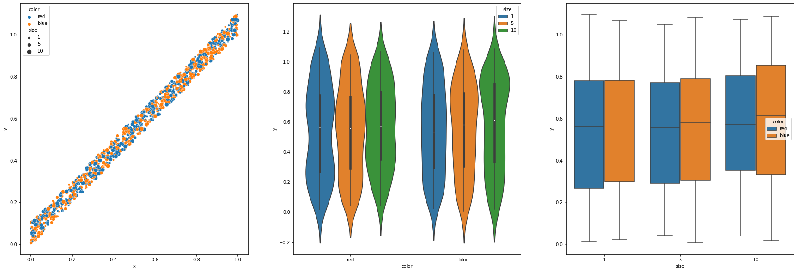

# Pandas

Numpy objects are very efficient for working with data that has several dimensions and the same type. However, is we work with data like the one that you could have in an Excel table, we have data of the form
 - Rows with elements (e.g. people)
 - Columns with properties (e.g. age, height, name...)

These datasets are in table format and the package `pandas` focus in working out with them.

Let's import it:


```python
import pandas as pd
```

## Upload files

We can upload files that are made for storing data as `.csv`, `.txt` or even `.xsl` files (you need some additional packages for this one).

For example, let's upload the `data.csv` file. If we have a look at it we will see that the first column has the names of the properties and that the data is separated by commas. 

We can use now the `pandas.read_csv` function to load it:


```python
d = pd.read_csv("data.csv",sep=",")
d
```


<div>
<style scoped>
    .dataframe tbody tr th:only-of-type {
        vertical-align: middle;
    }

    .dataframe tbody tr th {
        vertical-align: top;
    }

    .dataframe thead th {
        text-align: right;
    }
</style>
<table border="1" class="dataframe">
  <thead>
    <tr style="text-align: right;">
      <th></th>
      <th>x</th>
      <th>y</th>
      <th>size</th>
      <th>color</th>
    </tr>
  </thead>
  <tbody>
    <tr>
      <th>0</th>
      <td>0.690908</td>
      <td>0.772151</td>
      <td>5</td>
      <td>red</td>
    </tr>
    <tr>
      <th>1</th>
      <td>0.782319</td>
      <td>0.841711</td>
      <td>10</td>
      <td>blue</td>
    </tr>
    <tr>
      <th>2</th>
      <td>0.925735</td>
      <td>0.950798</td>
      <td>5</td>
      <td>red</td>
    </tr>
    <tr>
      <th>3</th>
      <td>0.116696</td>
      <td>0.166198</td>
      <td>1</td>
      <td>red</td>
    </tr>
    <tr>
      <th>4</th>
      <td>0.944515</td>
      <td>1.002926</td>
      <td>1</td>
      <td>red</td>
    </tr>
    <tr>
      <th>...</th>
      <td>...</td>
      <td>...</td>
      <td>...</td>
      <td>...</td>
    </tr>
    <tr>
      <th>995</th>
      <td>0.018881</td>
      <td>0.072454</td>
      <td>5</td>
      <td>blue</td>
    </tr>
    <tr>
      <th>996</th>
      <td>0.036489</td>
      <td>0.038360</td>
      <td>10</td>
      <td>blue</td>
    </tr>
    <tr>
      <th>997</th>
      <td>0.979937</td>
      <td>0.997538</td>
      <td>5</td>
      <td>red</td>
    </tr>
    <tr>
      <th>998</th>
      <td>0.111819</td>
      <td>0.183948</td>
      <td>10</td>
      <td>blue</td>
    </tr>
    <tr>
      <th>999</th>
      <td>0.017978</td>
      <td>0.112918</td>
      <td>10</td>
      <td>red</td>
    </tr>
  </tbody>
</table>
<p>1000 rows × 4 columns</p>
</div>


We can check the formats of each column,


```python
d.dtypes
```


    x        float64
    y        float64
    size       int64
    color     object
    dtype: object


And the shape of the table,


```python
d.shape
```


    (1000, 4)


You can get the name of the columns


```python
d.columns
```


    Index(['x', 'y', 'size', 'color'], dtype='object')


and indices


```python
d.index
```


    RangeIndex(start=0, stop=1000, step=1)


## Accessing the data from a DataFrame

You can access a DataFrame object by column:


```python
d["color"]
```


    0       red
    1      blue
    2       red
    3       red
    4       red
           ... 
    995    blue
    996    blue
    997     red
    998    blue
    999     red
    Name: color, Length: 1000, dtype: object


```python
d[["color","x"]]
```


<div>
<style scoped>
    .dataframe tbody tr th:only-of-type {
        vertical-align: middle;
    }

    .dataframe tbody tr th {
        vertical-align: top;
    }

    .dataframe thead th {
        text-align: right;
    }
</style>
<table border="1" class="dataframe">
  <thead>
    <tr style="text-align: right;">
      <th></th>
      <th>color</th>
      <th>x</th>
    </tr>
  </thead>
  <tbody>
    <tr>
      <th>0</th>
      <td>red</td>
      <td>0.690908</td>
    </tr>
    <tr>
      <th>1</th>
      <td>blue</td>
      <td>0.782319</td>
    </tr>
    <tr>
      <th>2</th>
      <td>red</td>
      <td>0.925735</td>
    </tr>
    <tr>
      <th>3</th>
      <td>red</td>
      <td>0.116696</td>
    </tr>
    <tr>
      <th>4</th>
      <td>red</td>
      <td>0.944515</td>
    </tr>
    <tr>
      <th>...</th>
      <td>...</td>
      <td>...</td>
    </tr>
    <tr>
      <th>995</th>
      <td>blue</td>
      <td>0.018881</td>
    </tr>
    <tr>
      <th>996</th>
      <td>blue</td>
      <td>0.036489</td>
    </tr>
    <tr>
      <th>997</th>
      <td>red</td>
      <td>0.979937</td>
    </tr>
    <tr>
      <th>998</th>
      <td>blue</td>
      <td>0.111819</td>
    </tr>
    <tr>
      <th>999</th>
      <td>red</td>
      <td>0.017978</td>
    </tr>
  </tbody>
</table>
<p>1000 rows × 2 columns</p>
</div>


Slicing it using the methods:

 - `DataFrame.loc` and give the name of the indexes and columns to extract 
 - `Dataframe.iloc` and give the position of the indexes and columns as a matrix positions


```python
d.loc[[1,3,4],["size","color"]]
```


<div>
<style scoped>
    .dataframe tbody tr th:only-of-type {
        vertical-align: middle;
    }

    .dataframe tbody tr th {
        vertical-align: top;
    }

    .dataframe thead th {
        text-align: right;
    }
</style>
<table border="1" class="dataframe">
  <thead>
    <tr style="text-align: right;">
      <th></th>
      <th>size</th>
      <th>color</th>
    </tr>
  </thead>
  <tbody>
    <tr>
      <th>1</th>
      <td>10</td>
      <td>blue</td>
    </tr>
    <tr>
      <th>3</th>
      <td>1</td>
      <td>red</td>
    </tr>
    <tr>
      <th>4</th>
      <td>1</td>
      <td>red</td>
    </tr>
  </tbody>
</table>
</div>


```python
d.iloc[1:4,[0,1]]
```


<div>
<style scoped>
    .dataframe tbody tr th:only-of-type {
        vertical-align: middle;
    }

    .dataframe tbody tr th {
        vertical-align: top;
    }

    .dataframe thead th {
        text-align: right;
    }
</style>
<table border="1" class="dataframe">
  <thead>
    <tr style="text-align: right;">
      <th></th>
      <th>x</th>
      <th>y</th>
    </tr>
  </thead>
  <tbody>
    <tr>
      <th>1</th>
      <td>0.782319</td>
      <td>0.841711</td>
    </tr>
    <tr>
      <th>2</th>
      <td>0.925735</td>
      <td>0.950798</td>
    </tr>
    <tr>
      <th>3</th>
      <td>0.116696</td>
      <td>0.166198</td>
    </tr>
  </tbody>
</table>
</div>


or giving a boolean array in a very similar way to numpy arrays


```python
get = d["color"] == "red"

d.loc[get,["x","y","color"]]
```


<div>
<style scoped>
    .dataframe tbody tr th:only-of-type {
        vertical-align: middle;
    }

    .dataframe tbody tr th {
        vertical-align: top;
    }

    .dataframe thead th {
        text-align: right;
    }
</style>
<table border="1" class="dataframe">
  <thead>
    <tr style="text-align: right;">
      <th></th>
      <th>x</th>
      <th>y</th>
      <th>color</th>
    </tr>
  </thead>
  <tbody>
    <tr>
      <th>0</th>
      <td>0.690908</td>
      <td>0.772151</td>
      <td>red</td>
    </tr>
    <tr>
      <th>2</th>
      <td>0.925735</td>
      <td>0.950798</td>
      <td>red</td>
    </tr>
    <tr>
      <th>3</th>
      <td>0.116696</td>
      <td>0.166198</td>
      <td>red</td>
    </tr>
    <tr>
      <th>4</th>
      <td>0.944515</td>
      <td>1.002926</td>
      <td>red</td>
    </tr>
    <tr>
      <th>5</th>
      <td>0.187152</td>
      <td>0.200097</td>
      <td>red</td>
    </tr>
    <tr>
      <th>...</th>
      <td>...</td>
      <td>...</td>
      <td>...</td>
    </tr>
    <tr>
      <th>988</th>
      <td>0.290339</td>
      <td>0.327376</td>
      <td>red</td>
    </tr>
    <tr>
      <th>992</th>
      <td>0.011615</td>
      <td>0.042034</td>
      <td>red</td>
    </tr>
    <tr>
      <th>994</th>
      <td>0.816584</td>
      <td>0.871884</td>
      <td>red</td>
    </tr>
    <tr>
      <th>997</th>
      <td>0.979937</td>
      <td>0.997538</td>
      <td>red</td>
    </tr>
    <tr>
      <th>999</th>
      <td>0.017978</td>
      <td>0.112918</td>
      <td>red</td>
    </tr>
  </tbody>
</table>
<p>502 rows × 3 columns</p>
</div>


and you can get the numpy array matrix of the dataframe at any point by calling the method `values`.


```python
d.values
```


    array([[0.690907632780836, 0.7721505346460712, 5, 'red'],
           [0.7823193350095718, 0.8417111928393948, 10, 'blue'],
           [0.9257350388045036, 0.9507975040319092, 5, 'red'],
           ...,
           [0.9799368676973442, 0.9975377075137878, 5, 'red'],
           [0.1118194605811619, 0.1839481814555008, 10, 'blue'],
           [0.0179776606164256, 0.1129177328017267, 10, 'red']], dtype=object)


## Operate with the DataFrame

Pandas have many implemented functions to already work and analyze the data.

Pot example, let's make check some statistics.


```python
d.mean()
```


    x       0.506637
    y       0.556973
    size    5.385000
    dtype: float64


```python
d.std()
```


    x       0.290625
    y       0.292242
    size    3.697357
    dtype: float64


and you can group by certain property


```python
d.groupby("color").mean()
```


<div>
<style scoped>
    .dataframe tbody tr th:only-of-type {
        vertical-align: middle;
    }

    .dataframe tbody tr th {
        vertical-align: top;
    }

    .dataframe thead th {
        text-align: right;
    }
</style>
<table border="1" class="dataframe">
  <thead>
    <tr style="text-align: right;">
      <th></th>
      <th>x</th>
      <th>y</th>
      <th>size</th>
    </tr>
    <tr>
      <th>color</th>
      <th></th>
      <th></th>
      <th></th>
    </tr>
  </thead>
  <tbody>
    <tr>
      <th>blue</th>
      <td>0.510904</td>
      <td>0.561445</td>
      <td>5.224900</td>
    </tr>
    <tr>
      <th>red</th>
      <td>0.502404</td>
      <td>0.552536</td>
      <td>5.543825</td>
    </tr>
  </tbody>
</table>
</div>


```python
d.groupby("color").std()
```


<div>
<style scoped>
    .dataframe tbody tr th:only-of-type {
        vertical-align: middle;
    }

    .dataframe tbody tr th {
        vertical-align: top;
    }

    .dataframe thead th {
        text-align: right;
    }
</style>
<table border="1" class="dataframe">
  <thead>
    <tr style="text-align: right;">
      <th></th>
      <th>x</th>
      <th>y</th>
      <th>size</th>
    </tr>
    <tr>
      <th>color</th>
      <th></th>
      <th></th>
      <th></th>
    </tr>
  </thead>
  <tbody>
    <tr>
      <th>blue</th>
      <td>0.294451</td>
      <td>0.295433</td>
      <td>3.727869</td>
    </tr>
    <tr>
      <th>red</th>
      <td>0.287011</td>
      <td>0.289267</td>
      <td>3.663636</td>
    </tr>
  </tbody>
</table>
</div>


## Interoperability with seaborn

As already mentioned when talking about plotting, seaborn and pandas are very well connected in the sense that you can provide a dataframe to a seaborn plotting function directly to make the plots.

See some examples:


```python
import seaborn as sns
import matplotlib.pyplot as plt
```


```python
fig,ax = plt.subplots(1,3,figsize=[30,10])

sns.scatterplot(data=d,x="x",y="y",hue="color",size="size",ax=ax[0])
sns.violinplot(data=d,x="color",y="y",hue="size",ax=ax[1])
sns.boxplot(data=d,x="size",y="y",hue="color",ax=ax[2]);
```


    

    


## Construct a DataFrame

You can construct an empty DataFrame.


```python
d = pd.DataFrame()
```

and fill it with data adding columns


```python
d["names"] = ["Paco","Helena","Sofia"]
d["age"] = [40,67,70]
```

or rows


```python
d.loc[len(d),:] = ["Fede",34]
d
```


<div>
<style scoped>
    .dataframe tbody tr th:only-of-type {
        vertical-align: middle;
    }

    .dataframe tbody tr th {
        vertical-align: top;
    }

    .dataframe thead th {
        text-align: right;
    }
</style>
<table border="1" class="dataframe">
  <thead>
    <tr style="text-align: right;">
      <th></th>
      <th>names</th>
      <th>age</th>
    </tr>
  </thead>
  <tbody>
    <tr>
      <th>0</th>
      <td>Paco</td>
      <td>40.0</td>
    </tr>
    <tr>
      <th>1</th>
      <td>Helena</td>
      <td>67.0</td>
    </tr>
    <tr>
      <th>2</th>
      <td>Sofia</td>
      <td>70.0</td>
    </tr>
    <tr>
      <th>3</th>
      <td>Fede</td>
      <td>34.0</td>
    </tr>
  </tbody>
</table>
</div>


and you can append other DataFrames of the same type


```python
d2 = pd.DataFrame()

d2["names"] = ["Selena","Aitor"]
d2["age"] = [27,56]
```


```python
dAdd = d.append(d2)
dAdd
```


<div>
<style scoped>
    .dataframe tbody tr th:only-of-type {
        vertical-align: middle;
    }

    .dataframe tbody tr th {
        vertical-align: top;
    }

    .dataframe thead th {
        text-align: right;
    }
</style>
<table border="1" class="dataframe">
  <thead>
    <tr style="text-align: right;">
      <th></th>
      <th>names</th>
      <th>age</th>
    </tr>
  </thead>
  <tbody>
    <tr>
      <th>0</th>
      <td>Paco</td>
      <td>40.0</td>
    </tr>
    <tr>
      <th>1</th>
      <td>Helena</td>
      <td>67.0</td>
    </tr>
    <tr>
      <th>2</th>
      <td>Sofia</td>
      <td>70.0</td>
    </tr>
    <tr>
      <th>3</th>
      <td>Fede</td>
      <td>34.0</td>
    </tr>
    <tr>
      <th>0</th>
      <td>Selena</td>
      <td>27.0</td>
    </tr>
    <tr>
      <th>1</th>
      <td>Aitor</td>
      <td>56.0</td>
    </tr>
  </tbody>
</table>
</div>


## Reformat the type of the columns

You can also reformat the type of columns.


```python
dAdd["age"] = dAdd["age"].astype(int)
dAdd
```


<div>
<style scoped>
    .dataframe tbody tr th:only-of-type {
        vertical-align: middle;
    }

    .dataframe tbody tr th {
        vertical-align: top;
    }

    .dataframe thead th {
        text-align: right;
    }
</style>
<table border="1" class="dataframe">
  <thead>
    <tr style="text-align: right;">
      <th></th>
      <th>names</th>
      <th>age</th>
    </tr>
  </thead>
  <tbody>
    <tr>
      <th>0</th>
      <td>Paco</td>
      <td>40</td>
    </tr>
    <tr>
      <th>1</th>
      <td>Helena</td>
      <td>67</td>
    </tr>
    <tr>
      <th>2</th>
      <td>Sofia</td>
      <td>70</td>
    </tr>
    <tr>
      <th>3</th>
      <td>Fede</td>
      <td>34</td>
    </tr>
    <tr>
      <th>0</th>
      <td>Selena</td>
      <td>27</td>
    </tr>
    <tr>
      <th>1</th>
      <td>Aitor</td>
      <td>56</td>
    </tr>
  </tbody>
</table>
</div>


## Save DataFrames

The dataset is straightforward to save using the method `DataFrame.to_X`, with `X` being a format to save.


```python
dAdd.to_csv("new_dataset.csv")
```

# Summary

By now, you should have learned:

 - Pandas is a package to manipulate and work with data tables.
 - How to load data.
 - How to access the data.
 - How to make basic operations in the data.
 - How to use seaborn in combination with pandas.
 - Construct new DataFrames.
 - Save DataFrames.


